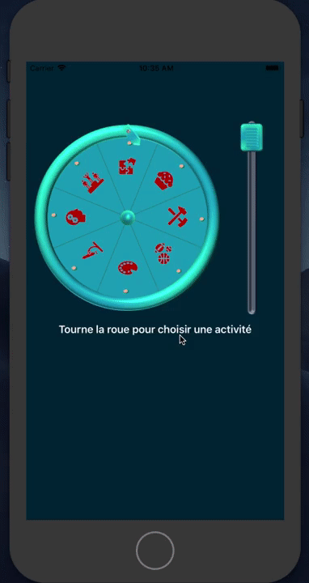

# RandomWheel 
Swift code for iOs of wheel animations : 
  - one wheel rotation in function of cursor swiped
  - one label rotation in slot machine style

<a href= "https://youtu.be/Q_bYZpHN-Ls">Lien Youtube</a>
